# 用例分析

> 基于 PRD：`docs/prd.md`
> 生成时间：2026-06-16

## 元信息

| 项目 | 值 |
|------|-----|
| PRD 文件 | docs/prd.md |
| PRD Hash | sha256:38524394… |
| Actor 数量 | 8 (4 人类 + 4 系统) |
| 用例数量 | 19 |

---

## 用例图

```mermaid
graph TD
  ACT-001((普通员工<br/>Employee)):::person
  ACT-002((分公司审核员<br/>L1Reviewer)):::person
  ACT-003((总公司审核员<br/>L2Reviewer)):::person
  ACT-004((超级管理员<br/>Admin)):::person
  ACT-SYS-001{{通知服务<br/>NotifyService}}:::system
  ACT-SYS-002{{MinIO对象存储<br/>MinIO}}:::system
  ACT-SYS-003{{评分引擎<br/>ScoringEngine}}:::system
  ACT-SYS-004{{自动预审引擎<br/>AutoReviewEngine}}:::system

  UC-001[创建首个管理员]
  UC-002[配置通知渠道]
  UC-003[管理组织架构]
  UC-004[设计申报模板]
  UC-005[发布/归档模板]
  UC-006[管理用户与角色]
  UC-007[批量导入用户]
  UC-008[员工注册]
  UC-009[登录系统]
  UC-010[填报绩效申报]
  UC-011[提交申报]
  UC-012[驳回后重提]
  UC-013[一级审核]
  UC-014[二级终审]
  UC-015[配置评分规则]
  UC-016[导入绩效事实]
  UC-017[导出绩效档案]
  UC-018[查看报表分析]
  UC-019[配置自动预审规则]

  ACT-004 --> UC-001
  ACT-004 --> UC-002
  ACT-004 --> UC-003
  ACT-004 --> UC-004
  ACT-004 --> UC-005
  ACT-004 --> UC-006
  ACT-004 --> UC-007
  ACT-004 --> UC-015
  ACT-004 --> UC-016
  ACT-004 --> UC-017
  ACT-004 --> UC-018
  ACT-004 --> UC-019
  ACT-001 --> UC-008
  ACT-001 --> UC-009
  ACT-004 --> UC-009
  ACT-001 --> UC-010
  ACT-001 --> UC-011
  ACT-001 --> UC-012
  ACT-002 --> UC-013
  ACT-003 --> UC-014

  ACT-SYS-001 -.-> UC-008
  ACT-SYS-001 -.-> UC-002
  ACT-SYS-002 -.-> UC-010
  ACT-SYS-003 -.-> UC-016
  ACT-SYS-004 -.-> UC-011

  classDef person fill:#d4eaf7,stroke:#2980b9
  classDef system fill:#f9e79f,stroke:#d4ac0d
  classDef usecase fill:#e8f8f5,stroke:#1abc9c
  class ACT-001,ACT-002,ACT-003,ACT-004 person
  class ACT-SYS-001,ACT-SYS-002,ACT-SYS-003,ACT-SYS-004 system
  class UC-001,UC-002,UC-003,UC-004,UC-005,UC-006,UC-007,UC-008,UC-009,UC-010,UC-011,UC-012,UC-013,UC-014,UC-015,UC-016,UC-017,UC-018,UC-019 usecase
```

---

## Actor 清单

| ID | 名称 | 英文 | 类型 | 描述 | PRD 出处 |
|----|------|------|------|------|----------|
| ACT-001 | 普通员工 | Employee | primary | 选择模板填报绩效申报、保存草稿、提交申报、处理驳回重提、查看个人年度档案 | §1.3, §3.5 |
| ACT-002 | 分公司审核员 | L1Reviewer | primary | 审核本分公司范围内的已提交申报，逐项通过或驳回 | §1.3, §3.6 |
| ACT-003 | 总公司审核员 | L2Reviewer | primary | 终审所有一级通过的申报，通过后自动归档 | §1.3, §3.6 |
| ACT-004 | 超级管理员 | Admin | primary | 全局系统配置、组织架构管理、模板设计、用户与角色管理、评分规则配置、数据导入导出、报表查看 | §1.3, §3.1–3.4, §3.7–3.10 |
| ACT-SYS-001 | 通知服务 | NotifyService | system | 发送短信/邮件验证码和通知（阿里云SMS / SMTP），异步执行不阻塞主流程 | §3.1.2 |
| ACT-SYS-002 | MinIO对象存储 | MinIO | system | 存储申报附件，提供预签名 URL 上传/下载 | §3.5.2, §3.9 |
| ACT-SYS-003 | 评分引擎 | ScoringEngine | system | 根据可配置规则（MATRIX/SHARE/NORMALIZE）将绩效事实自动计算为维度得分 | §3.7, §3.8 |
| ACT-SYS-004 | 自动预审引擎 | AutoReviewEngine | system | 提交申报时根据工龄与能级匹配规则自动校验申报资格 | §3.5.4 |

---

## 用例叙述

### UC-001: 创建首个管理员

| 属性 | 值 |
|------|-----|
| **ID** | UC-001 |
| **主 Actor** | ACT-004: 超级管理员 |
| **次 Actor** | 无 |
| **优先级** | P0 |
| **MVP 阶段** | M1 |
| **前置条件** | 1. 系统中不存在任何 ADMIN 角色用户 2. 数据库已初始化（NotifyConfig 默认记录已创建） |
| **后置条件** | 创建首个 ADMIN 用户并分配 ADMIN 角色，系统进入可管理状态 |
| **关联需求** | §3.1.1 |
| **PRD 出处** | §3.1.1 |

**主流程**：

1. 用户访问 `/admin/setup` 页面
2. 系统检查数据库不存在 ADMIN 角色用户，显示初始化表单
3. 用户填写姓名、联系方式、密码
4. 系统验证输入（Zod schema 校验），创建 User + UserRole(ADMIN)
5. 系统自动签发 `perf_session_admin` Cookie，重定向到 `/admin`

**备选流程**：

- **当系统中已存在 ADMIN 用户时**：
  1. 系统拒绝访问 `/admin/setup`，返回 403 或重定向到 `/admin/login`
- **当输入校验失败时**：
  1. 系统返回具体错误信息，用户修正后重新提交

---

### UC-002: 配置通知渠道

| 属性 | 值 |
|------|-----|
| **ID** | UC-002 |
| **主 Actor** | ACT-004: 超级管理员 |
| **次 Actor** | ACT-SYS-001: 通知服务 |
| **优先级** | P1 |
| **MVP 阶段** | M1 |
| **前置条件** | 1. 管理员已登录 2. NotifyConfig 记录存在 (id=1) |
| **后置条件** | 通知渠道配置更新，密钥 AES-256-GCM 加密存储，后续通知请求按新配置路由 |
| **关联需求** | §3.1.2 |
| **PRD 出处** | §3.1.2 |

**主流程**：

1. 管理员进入 `/admin/notify` 页面
2. 系统加载当前通知配置（渠道类型和脱敏后的配置）
3. 管理员选择渠道（SMS 或 EMAIL），填写对应配置项（SMS: AccessKey/签名/模板码，EMAIL: SMTP服务器/账号/密码）
4. 系统调用测试发送验证连接性
5. 管理员保存配置
6. 系统以 AES-256-GCM 加密敏感字段，写入 NotifyConfig

**备选流程**：

- **当测试发送失败时**：
  1. 系统显示发送失败原因，配置不保存，用户修正后重试
- **当管理员切换渠道类型时**：
  1. 系统提示"已有用户的联系方式可能与新渠道不兼容"，需管理员确认后继续

---

### UC-003: 管理组织架构

| 属性 | 值 |
|------|-----|
| **ID** | UC-003 |
| **主 Actor** | ACT-004: 超级管理员 |
| **次 Actor** | 无 |
| **优先级** | P1 |
| **MVP 阶段** | M1 |
| **前置条件** | 管理员已登录 |
| **后置条件** | 组织架构实体（分公司/部门/岗位/工种/能级）变更持久化 |
| **关联需求** | §3.2 |
| **PRD 出处** | §3.2 |

**主流程**：

1. 管理员进入 `/admin/organization` 页面
2. 系统展示五级实体列表（分公司、部门、岗位、工种、能级），支持标签页切换
3. 管理员对任意实体执行 CRUD 操作（新增填写 name + 可选 code/branchId；编辑修改；删除）
4. 系统通过 `/api/admin/organization` 持久化变更

**备选流程**：

- **当删除分公司有关联部门或用户时**：
  1. 系统拒绝删除，返回"存在关联数据，请先清理"
- **当删除部门/岗位/工种被用户引用时**：
  1. 系统拒绝删除，返回关联实体信息

---

### UC-004: 设计申报模板

| 属性 | 值 |
|------|-----|
| **ID** | UC-004 |
| **主 Actor** | ACT-004: 超级管理员 |
| **次 Actor** | 无 |
| **优先级** | P0 |
| **MVP 阶段** | M1 |
| **前置条件** | 管理员已登录 |
| **后置条件** | 创建或更新模板（DRAFT 状态），包含完整的章节-申报项-分值档次层级结构 |
| **关联需求** | §3.3 |
| **PRD 出处** | §3.3 |

**主流程**：

1. 管理员进入 `/admin/templates` 页面
2. 管理员创建新模板，填写年度 (year)、标题 (title)、描述 (description)
3. 管理员添加章节 (Section)，设置排序和名称
4. 在每个章节下添加申报项 (Item)，设置类型（SCORE/TEXT/COMBO）、满分 (maxScore)、维度码 (dimensionCode)
5. 对于 SCORE 型申报项，添加分值档次 (Option: label + score)
6. 可选：为章节/选项指定专属审核人 (SectionReviewer / FormOptionReviewer)
7. 保存模板（状态为 DRAFT）

**备选流程**：

- **当编辑已有模板时**：
  1. 管理员直接修改字段、添加/删除章节和申报项
  2. 系统保留原有结构，增量更新
- **当模板已发布（PUBLISHED）时**：
  1. 系统禁止直接编辑，需先下架为 DRAFT 或创建新版本

---

### UC-005: 发布/归档模板

| 属性 | 值 |
|------|-----|
| **ID** | UC-005 |
| **主 Actor** | ACT-004: 超级管理员 |
| **次 Actor** | 无 |
| **优先级** | P0 |
| **MVP 阶段** | M1 |
| **前置条件** | 模板处于 DRAFT 或 PUBLISHED 状态 |
| **后置条件** | 模板状态变更为 PUBLISHED（员工可见）或 ARCHIVED（历史封存） |
| **关联需求** | §3.3.1 |
| **PRD 出处** | §3.3.1 |

**主流程**：

1. 管理员在模板列表中选择目标模板
2. 点击「发布」按钮
3. 系统将模板状态从 DRAFT 改为 PUBLISHED，记录 `publishedAt` 时间戳
4. 模板立即对员工端可见

**备选流程**：

- **当下架已发布模板时**：
  1. 管理员点击「归档」
  2. 系统将状态从 PUBLISHED 改为 ARCHIVED
  3. 已归档的申报记录不受影响（使用 JSON 快照）
- **当模板已有员工申报记录时发布修改**：
  1. 系统提示"修改可能影响已申报员工"，确认后发布

---

### UC-006: 管理用户与角色

| 属性 | 值 |
|------|-----|
| **ID** | UC-006 |
| **主 Actor** | ACT-004: 超级管理员 |
| **次 Actor** | 无 |
| **优先级** | P1 |
| **MVP 阶段** | M1 |
| **前置条件** | 管理员已登录，系统中存在用户和组织架构 |
| **后置条件** | 用户角色变更持久化 |
| **关联需求** | §3.4.1 |
| **PRD 出处** | §3.4.1 |

**主流程**：

1. 管理员进入 `/admin/users` 页面
2. 系统展示用户列表及其当前角色
3. 管理员选择用户，分配 REVIEWER_L1（需指定分公司 scope）或 REVIEWER_L2 角色
4. 系统写入 UserRole，复合 unique 约束防止重复分配

**备选流程**：

- **当移除用户角色时**：
  1. 管理员点击角色旁的删除按钮
  2. 系统删除对应 UserRole 记录
  3. 如果是用户的唯一角色，系统提示"用户将失去所有权限"
- **当同一用户重复分配相同角色+分公司组合时**：
  1. 系统返回 409，提示"该角色已存在"

---

### UC-007: 批量导入用户

| 属性 | 值 |
|------|-----|
| **ID** | UC-007 |
| **主 Actor** | ACT-004: 超级管理员 |
| **次 Actor** | 无 |
| **优先级** | P1 |
| **MVP 阶段** | M1 |
| **前置条件** | 管理员已登录 |
| **后置条件** | CSV 中的用户被创建或更新，自动计算能级等级，无密码需员工注册认领 |
| **关联需求** | §3.4.2 |
| **PRD 出处** | §3.4.2 |

**主流程**：

1. 管理员进入 `/admin/users/import` 页面
2. 管理员上传 CSV 文件（工号、姓名、入职日期）
3. 系统解析 CSV，逐行处理：
   - 已有工号 → 更新姓名和入职日期
   - 新工号 → 创建用户（contact 临时=工号，passwordHash 为空，自动计算能级）
4. 系统展示导入结果（新建 N 人，更新 M 人，能级分布）

**备选流程**：

- **当 CSV 格式不正确时**：
  1. 系统返回"CSV 格式错误：缺少必需列（工号/姓名/入职日期）"
- **当入职日期格式无效时**：
  1. 系统跳过该行，记录到错误列表，继续处理其余行

---

### UC-008: 员工注册

| 属性 | 值 |
|------|-----|
| **ID** | UC-008 |
| **主 Actor** | ACT-001: 普通员工 |
| **次 Actor** | ACT-SYS-001: 通知服务 |
| **优先级** | P0 |
| **MVP 阶段** | M1 |
| **前置条件** | 通知渠道已配置（SMS 或 EMAIL） |
| **后置条件** | 用户创建成功，自动获得 EMPLOYEE 角色，可登录员工端 |
| **关联需求** | §3.4.3 |
| **PRD 出处** | §3.4.3 |

**主流程**：

1. 用户访问 `/register` 页面
2. 用户填写姓名、联系方式（手机号或邮箱，取决于系统通知渠道）、密码
3. 用户点击「发送验证码」
4. 系统调用通知服务发送 6 位验证码（60s 限频，5min 有效期）
5. 用户输入验证码并提交
6. 系统验证通过，创建 User + UserRole(EMPLOYEE)，签发 `perf_session` Cookie

**备选流程**：

- **当联系方式已被注册时**：
  1. 系统返回"该手机号/邮箱已注册"
- **当验证码错误或过期时**：
  1. 系统返回"验证码无效或已过期"
- **当 60s 内重复请求验证码时**：
  1. 系统返回"请 N 秒后再试"
- **当通知服务发送失败时**：
  1. 系统返回"验证码发送失败，请稍后重试"

---

### UC-009: 登录系统

| 属性 | 值 |
|------|-----|
| **ID** | UC-009 |
| **主 Actor** | ACT-001: 普通员工, ACT-004: 超级管理员 |
| **次 Actor** | 无 |
| **优先级** | P0 |
| **MVP 阶段** | M1 |
| **前置条件** | 用户已注册（员工）或已创建（管理员） |
| **后置条件** | 用户获得对应会话 Cookie（`perf_session` 或 `perf_session_admin`），7 天有效 |
| **关联需求** | — |
| **PRD 出处** | 技术架构-认证模型 |

**主流程**：

1. 员工访问 `/login`（或管理员访问 `/admin/login`）
2. 用户输入联系方式 + 密码
3. 系统验证凭据，签发 JWT，设置对应 Cookie
4. 重定向到对应首页（员工端 `/app`，管理端 `/admin`）

**备选流程**：

- **当凭据错误时**：
  1. 系统返回"用户名或密码错误"
- **当管理员尝试员工登录入口时**：
  1. 系统通过双 Cookie 隔离，管理员需使用 `/admin/login?admin=1`
- **当启用验证码策略时**：
  1. 登录流程增加验证码验证步骤
- **当 Cookie 过期时**：
  1. 用户被重定向到登录页，需重新认证

---

### UC-010: 填报绩效申报

| 属性 | 值 |
|------|-----|
| **ID** | UC-010 |
| **主 Actor** | ACT-001: 普通员工 |
| **次 Actor** | ACT-SYS-002: MinIO 对象存储 |
| **优先级** | P0 |
| **MVP 阶段** | M1 |
| **前置条件** | 1. 员工已登录 2. 存在至少一个 PUBLISHED 状态的模板 3. 该员工对该模板尚无已提交/审核中的申报（可覆盖草稿） |
| **后置条件** | 申报保存为草稿（DRAFT），可随时继续编辑或提交 |
| **关联需求** | §3.5.1, §3.5.2 |
| **PRD 出处** | §3.5.2 |

**主流程**：

1. 员工进入 `/app`，看到所有已发布模板列表
2. 员工选择一个模板，进入 `/app/submission/[templateId]`
3. 系统按章节顺序渲染所有申报项
4. 员工逐项填写：SCORE 型选择分值档次，TEXT 型填写文本备注，COMBO 型两者都有
5. 员工可随时为申报项上传附件（图片/文档到 MinIO）
6. 员工点击「保存草稿」，系统将 Submission（状态=DRAFT）和所有 SubmissionItem 持久化

**备选流程**：

- **当模板已被申报过（已有草稿）时**：
  1. 系统加载已有草稿数据，预填充所有已填写的申报项
  2. 用户继续编辑
- **当附件上传失败时**：
  1. 系统显示上传错误，用户可重试
- **当模板已被提交过（SUBMITTED 或审核中）时**：
  1. 系统展示只读视图，不允许编辑

---

### UC-011: 提交申报

| 属性 | 值 |
|------|-----|
| **ID** | UC-011 |
| **主 Actor** | ACT-001: 普通员工 |
| **次 Actor** | ACT-SYS-004: 自动预审引擎 |
| **优先级** | P0 |
| **MVP 阶段** | M1 |
| **前置条件** | 1. 员工已登录 2. 申报处于 DRAFT 或 REJECTED 状态 3. 所有申报项已填写 |
| **后置条件** | 申报状态变为 SUBMITTED，进入一级审核队列 |
| **关联需求** | §3.5.2, §3.5.4 |
| **PRD 出处** | §3.5.2–3.5.4 |

**主流程**：

1. 员工在申报填报页点击「提交」
2. 系统校验所有必填申报项是否已填写
3. 系统调用自动预审引擎：基于员工工龄和申报能级校验
4. 预审通过 → Submission 状态变为 SUBMITTED
5. 通知对应分公司的一级审核员

**备选流程**：

- **当有必填申报项未填写时**：
  1. 系统高亮未填写项，阻止提交
- **当自动预审不通过时**：
  1. 系统显示拒绝原因（如"您的工龄不满足该能级申报要求"）
  2. 申报保持 DRAFT/REJECTED 状态，员工需修正后重新提交
- **当无可用的一级审核员时**：
  1. 申报仍然提交成功，但审核队列为空，需管理员分配审核员

---

### UC-012: 驳回后重提

| 属性 | 值 |
|------|-----|
| **ID** | UC-012 |
| **主 Actor** | ACT-001: 普通员工 |
| **次 Actor** | 无 |
| **优先级** | P0 |
| **MVP 阶段** | M1 |
| **前置条件** | 申报状态为 REJECTED（被一级或二级审核员驳回） |
| **后置条件** | 申报状态变为 RESUBMITTED，仅改动项进入审核 |
| **关联需求** | §3.5.3 |
| **PRD 出处** | §3.5.3 |

**主流程**：

1. 员工在申报列表看到被驳回的申报（状态=REJECTED），点击进入
2. 系统渲染申报项：被驳回项可编辑（高亮显示驳回理由），其余项锁定只读
3. 员工修改被驳回项的内容或附件
4. 员工点击「重新提交」
5. 系统将状态改为 RESUBMITTED，仅将改动项的审核状态重置
6. 审核员仅看到改动项需要重新审核

**备选流程**：

- **当员工尝试编辑非驳回项时**：
  1. 系统拒绝编辑，该项处于锁定状态
- **当员工放弃修改时**：
  1. 申报保持 REJECTED 状态，不计入绩效档案

---

### UC-013: 一级审核（L1）

| 属性 | 值 |
|------|-----|
| **ID** | UC-013 |
| **主 Actor** | ACT-002: 分公司审核员 |
| **次 Actor** | ACT-001: 普通员工（被通知） |
| **优先级** | P0 |
| **MVP 阶段** | M1 |
| **前置条件** | 1. L1 审核员已登录 2. 该审核员所属分公司存在 SUBMITTED 或 RESUBMITTED 状态的申报 |
| **后置条件** | 所有申报项全部通过→状态变为 L1_APPROVED；任一项驳回→状态变为 REJECTED |
| **关联需求** | §3.6 |
| **PRD 出处** | §3.6.1–3.6.3 |

**主流程**：

1. 审核员进入 `/app/review` 审核工作台
2. 系统展示本分公司所有待审申报列表
3. 审核员选择一个申报，进入逐项审核视图
4. 审核员逐项查看：申报内容、分值选择、附件
5. 审核员对每个申报项做出决策（通过/驳回），驳回时填写理由
6. 全部通过 → 申报状态变为 L1_APPROVED，进入二级审核队列
7. 生成 ReviewLog 记录

**备选流程**：

- **当审核员驳��某项时**：
  1. 审核员选择「驳回」、填写驳回理由
  2. 整个申报状态变为 REJECTED（即使其他项已通过）
  3. 员工收到通知（如有通知渠道）
- **当审核员所在分公司范围外有申报时**：
  1. 系统不展示（按 scopeBranchId 过滤）

---

### UC-014: 二级终审（L2）

| 属性 | 值 |
|------|-----|
| **ID** | UC-014 |
| **主 Actor** | ACT-003: 总公司审核员 |
| **次 Actor** | ACT-001: 普通员工（被通知） |
| **优先级** | P0 |
| **MVP 阶段** | M1 |
| **前置条件** | 1. L2 审核员已登录 2. 存在 L1_APPROVED 状态的申报 |
| **后置条件** | 全部通过→生成 PerformanceRecord（归档）；任一项驳回→状态变为 REJECTED |
| **关联需求** | §3.6.4 |
| **PRD 出处** | §3.6.1–3.6.4 |

**主流程**：

1. 审核员进入 `/app/review` 审核工作台
2. 系统展示所有 L1_APPROVED 申报（不限分公司）
3. 审核员逐项审核（同 UC-013 流程）
4. 全部通过 → 系统自动计算总分 (`totalScore`)
5. 系统生成 `PerformanceRecord`（archivedData = JSON 快照），状态变为 APPROVED
6. 员工收到通过通知

**备选流程**：

- **当 L2 审核员驳回某项时**：
  1. 同 UC-013 驳回流程
  2. 申报回到员工端，仅驳回项可编辑
- **当同一员工同年已有一条 PerformanceRecord 时**：
  1. unique 约束 `[userId, year]` 阻止重复生成，系统返回错误

---

### UC-015: 配置评分规则

| 属性 | 值 |
|------|-----|
| **ID** | UC-015 |
| **主 Actor** | ACT-004: 超级管理员 |
| **次 Actor** | ACT-SYS-003: 评分引擎 |
| **优先级** | P1 |
| **MVP 阶段** | M2 |
| **前置条件** | 管理员已登录 |
| **后置条件** | 某维度的评分规则（MATRIX/SHARE/NORMALIZE）创建或更新，后续导入即按新规则计分 |
| **关联需求** | §3.7 |
| **PRD 出处** | §3.7.2–3.7.3 |

**主流程**：

1. 管理员进入 `/admin/scoring` 页面
2. 系统展示 14 个评价维度及已配置的规则
3. 管理员选择一个维度，设置规则类型和参数：
   - MATRIX: 配置缺陷等级 × 角色分数矩阵
   - SHARE: 配置角色份额和分组字段
   - NORMALIZE: 配置目标满分和折算来源
4. 管理员设置封顶分数 (cap) 和启用状态 (enabled)
5. 系统校验配置合法性（按规则类型的 Zod schema 校验），保存到 ScoringRule

**备选流程**：

- **当同一维度已配置规则时**：
  1. 系统返回 409 "该维度已配置规则，请编辑已有规则"
- **当 config 与 ruleType 不匹配时**：
  1. 系统返回"规则配置无效"，显示具体字段错误
- **当规则被禁用时**：
  1. 评分引擎跳过该维度，不计算分数

---

### UC-016: 导入绩效事实

| 属性 | 值 |
|------|-----|
| **ID** | UC-016 |
| **主 Actor** | ACT-004: 超级管理员 |
| **次 Actor** | ACT-SYS-003: 评分引擎 |
| **优先级** | P1 |
| **MVP 阶段** | M2 |
| **前置条件** | 1. 管理员已登录 2. 目标维度的评分规则已配置 3. Excel 数据文件符合格式 |
| **后置条件** | PerformanceFact 记录写入数据库（upsert），按维度自动计分 |
| **关联需求** | §3.8 |
| **PRD 出处** | §3.8 |

**主流程**：

1. 管理员进入 `/admin/import` 页面
2. 选择导入维度（缺陷治理/两票执行/安全贡献）
3. 上传对应 Excel 文件
4. 系统解析 Excel → 员工匹配（工号+姓名）→ 调用评分引擎计算得分
5. 系统将事实写入 PerformanceFact（upsert by 复合 unique）
6. 返回导入摘要（创建 N 条，更新 M 条，未匹配姓名列表）

**备选流程**：

- **当 Excel 列不匹配时**：
  1. 系统返回"文件格式不符合该维度的导入要求，期望列：{fields}"
- **当员工工号匹配失败时**：
  1. 记录到未匹配列表，跳过该行
- **当维度未配置评分规则时**：
  1. 系统跳过该维度的事实处理，仅在结果中说明

---

### UC-017: 导出绩效档案

| 属性 | 值 |
|------|-----|
| **ID** | UC-017 |
| **主 Actor** | ACT-004: 超级管理员 |
| **次 Actor** | ACT-SYS-002: MinIO 对象存储 |
| **优先级** | P1 |
| **MVP 阶段** | M2 |
| **前置条件** | 1. 管理员已登录 2. 存在已归档的 PerformanceRecord |
| **后置条件** | ZIP 流式下载完成，包含 manifest.csv + 每人 archive.json + 附件 |
| **关联需求** | §3.9 |
| **PRD 出处** | §3.9 |

**主流程**：

1. 管理员进入 `/admin/export` 页面
2. 选择分公司和年度
3. 点击「导出」
4. 系统流式构建 ZIP（archiver + MinIO 预签名读取），不落盘直写响应流
5. 浏览器下载 ZIP 文件

**备选流程**：

- **当选中分公司+年度无数据时**：
  1. 系统返回"该条件下无已归档记录"
- **当附件文件在 MinIO 中丢失时**：
  1. 系统跳过该附件，在 manifest 中标记"附件缺失"

---

### UC-018: 查看报表分析

| 属性 | 值 |
|------|-----|
| **ID** | UC-018 |
| **主 Actor** | ACT-004: 超级管理员 |
| **次 Actor** | 无 |
| **优先级** | P2 |
| **MVP 阶段** | M3 |
| **前置条件** | 管理员已登录，存在已审核通过的申报数据 |
| **后置条件** | 报表视图渲染完成 |
| **关联需求** | §3.10 |
| **PRD 出处** | §3.10 |

**主流程**：

1. 管理员进入 `/admin/reports` 页面
2. 系统展示：按模板统计已通过员工分值分布
3. 管理员可按模板筛选，查看审核进度和维度得分明细

**备选流程**：

- **当无数据时**：
  1. 系统显示空状态提示

---

### UC-019: 配置自动预审规则

| 属性 | 值 |
|------|-----|
| **ID** | UC-019 |
| **主 Actor** | ACT-004: 超级管理员 |
| **次 Actor** | ACT-SYS-004: 自动预审引擎 |
| **优先级** | P1 |
| **MVP 阶段** | M1 |
| **前置条件** | 管理员已登录 |
| **后置条件** | 自动预审规则持久化，后续提交申报时自动执行 |
| **关联需求** | §3.5.4 |
| **PRD 出处** | §3.5.4 |

**主流程**：

1. 管理员进入 `/admin/auto-review-rules` 页面
2. 创建规则：设置工龄区间 (min/max workYears)、允许的能级 (allowedLevelIds)、拒绝消息
3. 系统保存 AutoReviewRule
4. 员工提交申报时，系统自动按规则评估

**备选流程**：

- **当规则被禁用时**：
  1. 预审引擎跳过该规则
- **当多条规则同时匹配时**：
  1. 所有匹配规则均需通过（AND 逻辑），任一条未通过则拒绝

---

## 审查报告

### 术语一致性

> ℹ️ 未配置 `terminology_file`（`CONTEXT.md` 不存在），跳过术语一致性检查。术语一致性检查将在 `/grill-with-docs` 创建 `CONTEXT.md` 后可用。

### 覆盖度分析

| # | 描述 | PRD 出处 |
|---|------|----------|
| 1 | 登录验证策略配置（验证码开关、强密码规则）合并到 UC-002 的扩展中（当前未独立成用例，因该功能与通知渠道紧密耦合） | §3.1.3 |
| 2 | 找回密码功能未独立成用例（PRD 提及 `/forgot` 路由，但未在功能需求中展开详细流程） | 文件架构 |
| 3 | 量化积分报告生成（脚本）未独立成用例（为运维脚本，非 Web 交互功能，不在此分析范围） | §3.11 |
| 4 | 申报项级别的附件删除功能合并到 UC-010（填报流程中自然支持） | §3.5.2 |

### 自校验

| 检查项 | 结果 |
|--------|------|
| L1.2 ID 唯一性 | ✅ 所有 Actor ID 和 Use Case ID 无重复 |
| L1.3 actorRef 完整性 | ✅ 所有 useCase 引用的 actorRef 和 secondaryActors 均在 actors 数组中 |
| L1.4 Schema 完整性 | ✅ 所有必填字段完整 |
| L1.5 Mermaid 语法 | ✅ 节点 ID 定义与引用一致，classDef 应用于所有节点 |

### 待确认项

1. **优先级确认**：P0 用例（UC-001, UC-004, UC-005, UC-008, UC-009, UC-010, UC-011, UC-012, UC-013, UC-014）覆盖了「员工注册→申报→两级审核→归档」的核心业务闭环，确认无误？
2. **系统 Actor 确认**：评分引擎 (ACT-SYS-003) 和自动预审引擎 (ACT-SYS-004) 是从 PRD 业务规则推导的系统角色，是否有遗漏？
3. **异常场景确认**：当前已覆盖的主要异常场景包括：输入校验失败、权限不足、重复操作、数据不存在、外部服务失败。是否有重要的业务异常场景遗漏？
