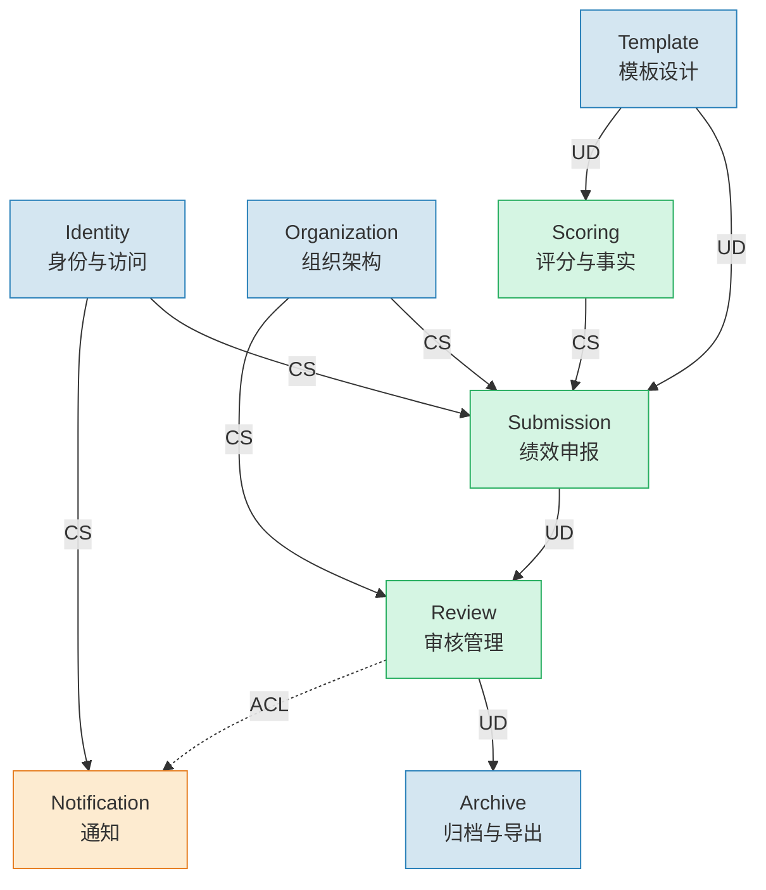
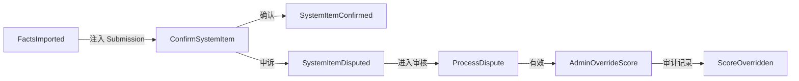

# 领域建模

> 基于 PRD：`docs/prd.md`
> 用例分析：`02-用例分析.md`
> 现有设计：`2026-06-13-architecture-decisions.md`（12 条设计原则、完整数据流、角色体系）
> 生成时间：2026-06-16
> 模式：**enhancement**（在现有架构决策基础上增量增强）

## 元信息

| 项目 | 值 |
|------|-----|
| 限界上下文数 | 8 |
| 聚合数 | 13 |
| 领域事件数 | 22 |
| 现有聚合 (existing) | 9 |
| 新推导聚合 (derived) | 4 |

---

## 限界上下文映射图

## 限界上下文清单

| ID | 名称 | 英文 | 类型 | 职责 | 来源 |
|----|------|------|------|------|------|
| BC-001 | 身份与访问 | Identity | supporting | 用户注册、登录、JWT 认证、角色绑定、密码管理 | existing |
| BC-002 | 组织架构 | Organization | supporting | 分公司/部门/岗位/工种/能级的 CRUD 与层级关系 | existing |
| BC-003 | 模板设计 | Template | supporting | 申报表模板的层级结构设计与生命周期管理（DRAFT→PUBLISHED→ARCHIVED） | existing |
| BC-004 | 绩效申报 | Submission | core | 员工填报申报表、保存草稿、提交、驳回重提、系统填充项确认/申诉 | existing |
| BC-005 | 审核管理 | Review | core | L1（分公司）逐项审核 + L2（总公司）终审，审核日志与决策记录 | existing |
| BC-006 | 评分与事实 | Scoring | core | 评分规则配置（MATRIX/SHARE/NORMALIZE）、外部事实数据导入、自动计分 | existing |
| BC-007 | 通知 | Notification | generic | 短信/邮件渠道配置、验证码发送、审核状态通知（异步、不阻塞主流程） | existing |
| BC-008 | 归档与导出 | Archive | supporting | 终审通过后生成年度绩效档案（双存：totalScore + archivedData JSON 快照）、按分公司/年度 ZIP 导出 | existing |

### 上下文关系

| From | To | 模式 | 说明 |
|------|----|------|------|
| BC-001 → BC-004 | CS (客户/供应商) | Identity 提供用户身份和角色信息，Submission 消费 |
| BC-002 → BC-004 | CS | Organization 提供分公司/部门/能级数据，Submission 消费（表头预填、能级计算） |
| BC-002 → BC-005 | CS | Organization 提供分公司范围，Review 按 scopeBranchId 过滤 L1 可见性 |
| BC-003 → BC-004 | UD (上游/下游) | Template 发布后 Submission 引用其结构；模板变更不影响已有申报（快照隔离） |
| BC-003 → BC-006 | UD | Template 的 dimensionCode 定义 Scoring 的事实归集目标 |
| BC-004 → BC-005 | UD | Submission 提交后触发 Review 流程；驳回后反馈回 Submission |
| BC-006 → BC-004 | CS | Scoring 生成的 PerformanceFact 作为系统填充项注入 Submission |
| BC-005 → BC-008 | UD | Review L2 全部通过后触发 Archive 归档 |
| BC-001 → BC-007 | CS | Identity 提供用户联系方式，Notification 消费 |
| BC-005 → BC-007 | ACL (防腐层) | Review 状态变更通过防腐层适配为通知消息，异步发送 |

---

## 聚合设计

### AGG-001: User (所属: BC-001 Identity)

| 属性 | 值 |
|------|-----|
| **聚合根** | User |
| **所属上下文** | BC-001 Identity |
| **来源** | existing |

**实体**：

| 名称 | 描述 |
|------|------|
| User | 用户核心实体：contact（联系方式）、passwordHash、fullName、employeeNo、hireDate、branch/department/position/jobType/employeeLevel 引用 |
| UserRole | 用户角色：[userId, role, scopeBranchId] 复合唯一 |

**值对象**：

| 名称 | 描述 |
|------|------|
| VerifyCode | 6位验证码 + 过期时间 + 限频窗口（60s） |

**命令**：

| 命令 | 触发者 | 关联用例 | 描述 |
|------|--------|----------|------|
| RegisterUser | ACT-001 | UC-008 | 验证码注册，创建 User + EMPLOYEE 角色 |
| LoginEmployee | ACT-001 | UC-009 | 员工登录，签发 perf_session JWT |
| LoginAdmin | ACT-004 | UC-009 | 管理员登录，签发 perf_session_admin JWT |
| SetupFirstAdmin | ACT-004 | UC-001 | 系统首次初始化，创建首个 ADMIN |
| AssignRole | ACT-004 | UC-006 | 为用户分配审核员角色 |
| RevokeRole | ACT-004 | UC-006 | 移除用户角色 |
| ImportUsers | ACT-004 | UC-007 | 批量导入用户（CSV），自动计算能级 |
| SendVerifyCode | ACT-001 | UC-008 | 请求发送验证码（60s 限频） |
| ResetPassword | ACT-001 | — | 验证码重置密码 |

**领域事件**：

| 事件 | 触发命令 | 核心 Payload | 描述 |
|------|----------|-------------|------|
| UserRegistered | RegisterUser | userId, contact, fullName | 新员工注册成功 |
| FirstAdminCreated | SetupFirstAdmin | userId, contact | 系统首次初始化完成 |
| RoleAssigned | AssignRole | userId, role, scopeBranchId | 用户获得新角色 |
| RoleRevoked | RevokeRole | userId, role | 用户角色被移除 |
| UsersImported | ImportUsers | createdCount, updatedCount, levels | 批量导入完成 |
| VerifyCodeSent | SendVerifyCode | contact, purpose | 验证码已发送 |

**不变量**：

1. `User.contact` 全局唯一
2. `User.employeeNo` 全局唯一（可选字段）
3. `UserRole`: 同一 `[userId, role, scopeBranchId]` 组合不可重复
4. `SetupFirstAdmin`: 仅当系统无 ADMIN 时可执行
5. `ImportUsers`: 无密码用户（passwordHash=''）必须通过注册认领
6. `SendVerifyCode`: 同一 contact 60s 内不可重复发送

---

### AGG-002: Branch (所属: BC-002 Organization)

| 属性 | 值 |
|------|-----|
| **聚合根** | Branch |
| **所属上下文** | BC-002 Organization |
| **来源** | existing |

**实体**：

| 名称 | 描述 |
|------|------|
| Branch | 分公司：name, code（唯一） |
| Department | 部门：name, branchId |

**值对象**：

| 名称 | 描述 |
|------|------|
| Position | 岗位：name |
| JobType | 工种：name |
| EmployeeLevel | 能级：name |

> 注：Position、JobType、EmployeeLevel 为独立小聚合（各只有 name 字段），此处归入 Branch 上下文中列出，不再独立展开。

**命令**：

| 命令 | 触发者 | 关联用例 | 描述 |
|------|--------|----------|------|
| CreateBranch | ACT-004 | UC-003 | 创建分公司 |
| UpdateBranch | ACT-004 | UC-003 | 编辑分公司 |
| DeleteBranch | ACT-004 | UC-003 | 删除分公司（无关联数据时） |
| ManageDepartment | ACT-004 | UC-003 | 部门 CRUD |
| ManagePosition | ACT-004 | UC-003 | 岗位 CRUD |
| ManageJobType | ACT-004 | UC-003 | 工种 CRUD |
| ManageEmployeeLevel | ACT-004 | UC-003 | 能级 CRUD |

**领域事件**：

| 事件 | 触发命令 | 核心 Payload | 描述 |
|------|----------|-------------|------|
| BranchCreated | CreateBranch | branchId, name, code | 分公司已创建 |
| BranchUpdated | UpdateBranch | branchId, changedFields | 分公司信息变更 |
| BranchDeleted | DeleteBranch | branchId | 分公司已删除 |
| OrganizationChanged | ManageDepartment/Position/JobType/EmployeeLevel | entity, action, id | 组织架构实体变更 |

**不变量**：

1. `Branch.code` 全局唯一
2. `DeleteBranch`: 仅当无关联 Department 和 User 时可删除
3. `DeleteDepartment`: 仅当无关联 User 时可删除

---

### AGG-003: FormTemplate (所属: BC-003 Template)

| 属性 | 值 |
|------|-----|
| **聚合根** | FormTemplate |
| **所属上下文** | BC-003 Template |
| **来源** | existing |

**实体**：

| 名称 | 描述 |
|------|------|
| FormTemplate | 模板：year, title, description, status (DRAFT/PUBLISHED/ARCHIVED), publishedAt |
| FormSection | 章节：title, description, sortOrder |
| FormItem | 申报项：type (SCORE/TEXT/COMBO), maxScore, dimensionCode, sortOrder |
| FormOption | 分值档次：label, score |
| SectionReviewer | 章节级专属审核人：userId, sectionId |
| FormOptionReviewer | 选项级专属审核人：userId, optionId |

**命令**：

| 命令 | 触发者 | 关联用例 | 描述 |
|------|--------|----------|------|
| CreateTemplate | ACT-004 | UC-004 | 创建模板（DRAFT） |
| UpdateTemplate | ACT-004 | UC-004 | 编辑模板结构和内容 |
| AddSection | ACT-004 | UC-004 | 添加章节 |
| AddItem | ACT-004 | UC-004 | 添加申报项（含 dimensionCode 绑定） |
| AddOption | ACT-004 | UC-004 | 添加分值档次 |
| AssignSectionReviewer | ACT-004 | UC-004 | 指定章节专属审核人 |
| PublishTemplate | ACT-004 | UC-005 | 发布模板（DRAFT → PUBLISHED） |
| ArchiveTemplate | ACT-004 | UC-005 | 归档模板（PUBLISHED → ARCHIVED） |
| PatchTemplateText | ACT-004 | — | 文字修订（仅 PUBLISHED 状态允许，不改结构/分值） |

**领域事件**：

| 事件 | 触发命令 | 核心 Payload | 描述 |
|------|----------|-------------|------|
| TemplatePublished | PublishTemplate | templateId, year, publishedAt | 模板已发布，员工可见 |
| TemplateArchived | ArchiveTemplate | templateId | 模板已归档封存 |

**不变量**：

1. PUBLISHED 后不可修改结构和分值（仅允许 PatchTemplateText 文字修订）
2. FormItem 的 dimensionCode 必须来自预定义枚举列表
3. SCORE 型 FormItem 必须至少有一个 FormOption
4. 删除模板时级联删除所有 Section/Item/Option

---

### AGG-004: Submission (所属: BC-004 Submission)

| 属性 | 值 |
|------|-----|
| **聚合根** | Submission |
| **所属上下文** | BC-004 Submission |
| **来源** | existing |

**实体**：

| 名称 | 描述 |
|------|------|
| Submission | 申报：userId, templateId, status (DRAFT/SUBMITTED/L1_REVIEWING/L1_APPROVED/L2_REVIEWING/APPROVED/REJECTED/RESUBMITTED), totalScore, headerFields (JSON: branch, department, hireDate, level, specialty) |
| SubmissionItem | 申报项：itemId, selectedOptions (分值选择), textContent (文本备注), confirmationStatus (CONFIRMED/DISPUTED), locked (被驳回锁定) |
| Attachment | 附件：submissionId, itemId, filename, minioPath |

**值对象**：

| 名称 | 描述 |
|------|------|
| HeaderFields | 表头字段：branch, department, position, jobType, hireDate, declarationLevel（系统自动计算） |
| PreReviewResult | 预审结果：passed, warnings[]（软提示不阻断） |

**命令**：

| 命令 | 触发者 | 关联用例 | 描述 |
|------|--------|----------|------|
| StartSubmission | ACT-001 | UC-010 | 选择模板开始申报，创建 DRAFT Submission |
| SaveDraft | ACT-001 | UC-010 | 保存草稿（更新 SubmissionItem + Attachment） |
| UploadAttachment | ACT-001 | UC-010 | 上传附件到 MinIO |
| DeleteAttachment | ACT-001 | UC-010 | 删除附件 |
| SubmitDeclaration | ACT-001 | UC-011 | 提交申报（DRAFT/REJECTED → SUBMITTED/RESUBMITTED） |
| ConfirmSystemItem | ACT-001 | — | 确认系统填充项 → 锁定分数 |
| DisputeSystemItem | ACT-001 | — | 申诉系统填充项 → 进入审核链路 |
| ResubmitAfterRejection | ACT-001 | UC-012 | 驳回后重提（仅编辑被驳回项） |
| CalculateDeclarationLevel | SYS | — | 系统根据入职时间自动计算能级等级 |

**领域事件**：

| 事件 | 触发命令 | 核心 Payload | 描述 |
|------|----------|-------------|------|
| SubmissionDrafted | SaveDraft | submissionId, userId, templateId | 草稿已保存 |
| SubmissionSubmitted | SubmitDeclaration | submissionId, userId, templateId, preReviewWarnings | 申报已提交，进入审核 |
| SubmissionResubmitted | ResubmitAfterRejection | submissionId, changedItemIds | 驳回后重新提交 |
| SystemItemConfirmed | ConfirmSystemItem | submissionId, itemId, score | 系统填充项已确认锁定 |
| SystemItemDisputed | DisputeSystemItem | submissionId, itemId, reason | 系统填充项被申诉 |

**不变量**：

1. `[userId, templateId]` 复合唯一 — 一人一模板只有一份申报
2. 驳回重提时仅 `locked=false` 的项可编辑
3. 提交时所有必填申报项必须已填写
4. 预审不通过不阻断提交（软提示）
5. declarationLevel 由系统根据 hireDate 实时计算，员工不可修改
6. 系统填充项（有对应 PerformanceFact 的项）确认后锁定，申诉后进入审核链路

---

### AGG-005: ReviewDecision (所属: BC-005 Review)

| 属性 | 值 |
|------|-----|
| **聚合根** | SubmissionOptionReview |
| **所属上下文** | BC-005 Review |
| **来源** | existing |

**实体**：

| 名称 | 描述 |
|------|------|
| SubmissionOptionReview | 逐选项审核记录：submissionId, itemId, optionId, decision (APPROVE/REJECT), reviewerId, reason, level (L1/L2) |
| ReviewLog | 审核日志（不可变审计记录）：submissionId, action, reviewerId, oldStatus, newStatus, details, timestamp |

**值对象**：

| 名称 | 描述 |
|------|------|
| ReviewDecision | 审核决策：APPROVE | REJECT |
| ReviewLevel | 审核级别：L1 | L2 |
| AdminOverride | ADMIN 覆盖分数记录：oldScore, newScore, reason, relatedDisputeId |

**命令**：

| 命令 | 触发者 | 关联用例 | 描述 |
|------|--------|----------|------|
| StartL1Review | ACT-002 | UC-013 | 开始一级审核（状态 → L1_REVIEWING） |
| MakeL1OptionDecision | ACT-002 | UC-013 | 逐项做出通过/驳回决策 |
| CompleteL1Review | ACT-002 | UC-013 | 完成一级审核（全部通过→L1_APPROVED；任一驳回→REJECTED） |
| StartL2Review | ACT-003 | UC-014 | 开始二级审核（状态 → L2_REVIEWING） |
| MakeL2OptionDecision | ACT-003 | UC-014 | 逐项做出通过/驳回决策 |
| CompleteL2Review | ACT-003 | UC-014 | 完成二级终审（全部通过→APPROVED；任一驳回→REJECTED） |
| ProcessDispute | ACT-003 | — | L2 处理申诉（确认有效→允许 ADMIN 覆盖；驳回→维持系统分数） |
| AdminOverrideScore | ACT-004 | — | ADMIN 覆盖申诉分数（须记录 ReviewLog ADMIN_OVERRIDE） |

**领域事件**：

| 事件 | 触发命令 | 核心 Payload | 描述 |
|------|----------|-------------|------|
| L1ReviewStarted | StartL1Review | submissionId, reviewerId | 一级审核开始 |
| L1OptionApproved | MakeL1OptionDecision | submissionId, itemId, optionId, reviewerId | 单项通过 |
| L1OptionRejected | MakeL1OptionDecision | submissionId, itemId, optionId, reason | 单项驳回 |
| L1ReviewCompleted | CompleteL1Review | submissionId, result (APPROVED/REJECTED) | 一级审核完成 |
| L2ReviewStarted | StartL2Review | submissionId, reviewerId | 二级审核开始 |
| L2ReviewCompleted | CompleteL2Review | submissionId, result (APPROVED/REJECTED), totalScore | 二级终审完成 |
| SubmissionApproved | CompleteL2Review | submissionId, userId, year, totalScore | 申报最终通过，触发归档 |
| DisputeResolved | ProcessDispute | submissionId, itemId, resolution | 申诉已处理 |
| ScoreOverridden | AdminOverrideScore | submissionId, itemId, oldScore, newScore, reason | ADMIN 覆盖分数（可审计） |

**不变量**：

1. L1 审核员只能审核 scopeBranchId 匹配的分公司申报
2. L2 审核员可审核所有 L1_APPROVED 申报（无分公司限制）
3. 审核必须逐项决策（无整表通过/驳回操作）
4. 所有审核决策必须记录 ReviewLog（不可变审计）
5. ADMIN 覆盖分数必须记录 oldScore → newScore + reason（可追溯）
6. L2 全部通过后自动触发归档

---

### AGG-006: ScoringRule (所属: BC-006 Scoring)

| 属性 | 值 |
|------|-----|
| **聚合根** | ScoringRule |
| **所属上下文** | BC-006 Scoring |
| **来源** | existing |

**值对象**：

| 名称 | 描述 |
|------|------|
| MatrixConfig | MATRIX 型配置：缺陷等级 × 角色 → 分数矩阵 + cap |
| ShareConfig | SHARE 型配置：角色份额 × 分组字段 + cap |
| NormalizeConfig | NORMALIZE 型配置：targetMaxScore + sourceKey + normalizeWithin |

**命令**：

| 命令 | 触发者 | 关联用例 | 描述 |
|------|--------|----------|------|
| CreateScoringRule | ACT-004 | UC-015 | 为维度创建评分规则（每个维度仅一条规则） |
| UpdateScoringRule | ACT-004 | UC-015 | 编辑评分规则 |
| DeleteScoringRule | ACT-004 | UC-015 | 删除评分规则 |
| EnableScoringRule | ACT-004 | UC-015 | 启用规则 |
| DisableScoringRule | ACT-004 | UC-015 | 禁用规则（评分引擎跳过该维度） |

**不变量**：

1. `dimensionCode` 唯一 — 每个维度仅一条规则
2. config 必须与 ruleType 匹配（Zod schema 校验）
3. cap 必须 ≥ 0

---

### AGG-007: PerformanceFact (所属: BC-006 Scoring)

| 属性 | 值 |
|------|-----|
| **聚合根** | PerformanceFact |
| **所属上下文** | BC-006 Scoring |
| **来源** | existing |

**实体**：

| 名称 | 描述 |
|------|------|
| PerformanceFact | 事实记录：year, employeeNo, dimensionCode, role, eventType, defectLevel, defectRef, score, sourceFile, metadata (JSON) |

**值对象**：

| 名称 | 描述 |
|------|------|
| DefectLevel | 缺陷等级：危急 / 严重 / 一般 |
| FactRole | 角色：FIRST_DISCOVERER / CO_DISCOVERER / FIRST_HANDLER / CO_HANDLER |
| EventType | 事件类型：DISCOVERY / REMEDIATION |

**命令**：

| 命令 | 触发者 | 关联用例 | 描述 |
|------|--------|----------|------|
| ImportDefectFacts | ACT-004 | UC-016 | 从运检部缺陷库 Excel 导入缺陷治理事实 |
| ImportTicketFacts | ACT-004 | UC-016 | 从两票公示汇总 Excel 导入两票执行事实 |
| ImportSafetyFacts | ACT-004 | UC-016 | 从安全贡献审批单导入安全贡献事实 |
| ComputeScores | ACT-SYS-003 | — | 评分引擎批量计算事实得分 |

**领域事件**：

| 事件 | 触发命令 | 核心 Payload | 描述 |
|------|----------|-------------|------|
| FactsImported | ImportDefectFacts / ImportTicketFacts / ImportSafetyFacts | dimensionCode, created, updated, unmatchedNames | 事实数据导入完成 |
| ScoresComputed | ComputeScores | dimensionCode, factCount, scoreDistribution | 评分计算完成 |

**不变量**：

1. `[year, employeeNo, dimensionCode, defectRef, role, eventType]` 复合唯一（去重）
2. 评分计算必须在导入时（或规则变更后）执行
3. 未配置规则的维度跳过计算
4. 批量导入必须在单事务内完成

---

### AGG-008: NotifyConfig (所属: BC-007 Notification)

| 属性 | 值 |
|------|-----|
| **聚合根** | NotifyConfig |
| **所属上下文** | BC-007 Notification |
| **来源** | existing |

**值对象**：

| 名称 | 描述 |
|------|------|
| SmsConfig | 阿里云短信配置：accessKeyId, accessKeySecret (AES-256-GCM), signName, templateCode |
| EmailConfig | SMTP 邮件配置：host, port, secure, user, pass (AES-256-GCM), from |

**命令**：

| 命令 | 触发者 | 关联用例 | 描述 |
|------|--------|----------|------|
| ConfigureNotifyChannel | ACT-004 | UC-002 | 选择并配置通知渠道 |
| TestNotifyChannel | ACT-004 | UC-002 | 测试渠道连通性 |
| SendNotification | SYS | — | 异步发送通知（不阻塞主流程） |

**领域事件**：

| 事件 | 触发命令 | 核心 Payload | 描述 |
|------|----------|-------------|------|
| NotifyChannelChanged | ConfigureNotifyChannel | channel, updatedBy | 通知渠道已变更 |

**不变量**：

1. `id` 恒为 1（单例模式）
2. 密钥字段以 AES-256-GCM 加密存储
3. 发送失败不抛出异常（`sendNotice().catch(() => {})`）
4. 渠道类型切换需提示兼容性风险

---

### AGG-009: PerformanceRecord (所属: BC-008 Archive)

| 属性 | 值 |
|------|-----|
| **聚合根** | PerformanceRecord |
| **所属上下文** | BC-008 Archive |
| **来源** | existing |

**实体**：

| 名称 | 描述 |
|------|------|
| PerformanceRecord | 年度绩效档案：userId, year, totalScore, archivedData (JSON 快照: submission + items + attachments + section scores + templateMaxScore) |

**命令**：

| 命令 | 触发者 | 关联用例 | 描述 |
|------|--------|----------|------|
| CreatePerformanceRecord | SYS | UC-014 | L2 全部通过后自动归档 |
| ExportArchive | ACT-004 | UC-017 | 按分公司+年度流式 ZIP 导出 |

**领域事件**：

| 事件 | 触发命令 | 核心 Payload | 描述 |
|------|----------|-------------|------|
| PerformanceRecordCreated | CreatePerformanceRecord | userId, year, totalScore | 年度绩效档案已归档 |
| ArchiveExported | ExportArchive | branchId, year, fileCount | 档案 ZIP 已导出 |

**不变量**：

1. `[userId, year]` 复合唯一 — 一人一年一条档案
2. `archivedData` 为归档时刻的完整 JSON 快照（终态不可变）
3. `totalScore` 归档时固化，不受后续模板变更影响

---

### AGG-010: AutoReviewRule (所属: BC-004 Submission)

| 属性 | 值 |
|------|-----|
| **聚合根** | AutoReviewRule |
| **所属上下文** | BC-004 Submission |
| **来源** | derived |

**实体**：

| 名称 | 描述 |
|------|------|
| AutoReviewRule | 预审规则：name, enabled, minWorkYears, maxWorkYears, allowedLevelIds[], rejectMessage |

**命令**：

| 命令 | 触发者 | 关联用例 | 描述 |
|------|--------|----------|------|
| CreateAutoReviewRule | ACT-004 | UC-019 | 创建预审规则 |
| UpdateAutoReviewRule | ACT-004 | UC-019 | 编辑预审规则 |
| DeleteAutoReviewRule | ACT-004 | UC-019 | 删除预审规则 |
| EvaluatePreReview | ACT-SYS-004 | UC-011 | 提交时自动评估所有启用规则 |

**不变量**：

1. 多条规则同时匹配时全部需通过（AND 逻辑）
2. 预审不通过不阻断提交（软提示）

---

### AGG-011: FieldMapping (所属: BC-006 Scoring)

| 属性 | 值 |
|------|-----|
| **聚合根** | FieldMapping |
| **所属上下文** | BC-006 Scoring |
| **来源** | derived |

**描述**：管理员上传各部门源 Excel 时，手动建立"Excel 列头 → 系统字段"的映射。映射配置保存，同维度下次自动匹配。

**命令**：

| 命令 | 触发者 | 关联用例 | 描述 |
|------|--------|----------|------|
| MapFields | ACT-004 | UC-016 | 手动映射 Excel 列头到系统字段 |
| SaveFieldMapping | ACT-004 | UC-016 | 保存映射配置供下次复用 |

---

### AGG-012: AuthConfig (所属: BC-001 Identity)

| 属性 | 值 |
|------|-----|
| **聚合根** | AuthConfig |
| **所属上下文** | BC-001 Identity |
| **来源** | derived |

**描述**：登录验证策略配置（验证码开关、强密码规则）。

**命令**：

| 命令 | 触发者 | 关联用例 | 描述 |
|------|--------|----------|------|
| ConfigureAuthPolicy | ACT-004 | — | 配置验证码开关和密码策略 |

---

### AGG-013: DeclarationLevel (所属: BC-004 Submission)

| 属性 | 值 |
|------|-----|
| **聚合根** | (值对象) |
| **所属上下文** | BC-004 Submission |
| **来源** | derived |

**描述**：能级等级计算规则。基于入职时间到当前日期的整年工龄：
- 0–4 年 → 一级
- 5–7 年 → 二级
- 8 年以上 → 三级

系统在员工申报时自动计算并填入 headerFields，员工不可修改。这一计算逻辑已实现在 `src/lib/declaration-level.ts` 中，作为 Submission 上下文的领域服务。

---

## 事件风暴总结

### 核心流程事件链

```mermaid
graph LR
  E1[TemplatePublished] -->|员工可见模板| C1[StartSubmission]
  C1 -->|DRAFT| E2[SubmissionDrafted]
  E2 -->|员工提交| C2[SubmitDeclaration]
  C2 -->|预审通过| E3[SubmissionSubmitted]
  E3 -->|触发| C3[StartL1Review]
  C3 -->|逐项审核| E4[L1ReviewCompleted]
  E4 -->|全部通过| C4[StartL2Review]
  C4 -->|终审通过| E5[SubmissionApproved]
  E5 -->|触发归档| C5[CreatePerformanceRecord]
  C5 -->|归档完成| E6[PerformanceRecordCreated]
```

### 驳回分支

### 系统填充项分支

---

## 审查报告

### 术语一致性

> ℹ️ 未配置 `terminology_file`（`CONTEXT.md` 不存在），跳过术语一致性检查。

### 边界问题

| # | 描述 | 建议 |
|---|------|------|
| 1 | AutoReviewRule 归属 Submission 还是独立上下文？ | 当前归入 Submission（预审是提交流程的一部分），如后续规则复杂度增加可独立 |
| 2 | DeclarationLevel 作为领域服务而非独立聚合 | 合理——它是纯计算逻辑（hireDate → years → level），无持久化状态 |
| 3 | FieldMapping 与其他聚合关联弱 | 当前归入 Scoring（字段映射服务于事实导入），合理 |

### 缺失聚合检查

| # | 用例 | 状态 |
|---|------|------|
| UC-018 报表分析 | ✅ 为查询视图，不引入新聚合（读取已有 PerformanceRecord + Submission 数据） |
| UC-002 登录策略 | ✅ 归入 AuthConfig（AGG-012），与通知配置分离 |

### 待确认项

1. **限界上下文边界**：8 个上下文是否合理？特别是 `AutoReviewRule` 和 `DeclarationLevel` 归入 Submission 上下文的决定？
2. **申诉流程聚合归属**：当前 `ProcessDispute` 和 `AdminOverrideScore` 在 Review 上下文中，是否应该独立为 `Dispute` 聚合？
3. **FieldMapping 持久化**：✅ 已确认 — 存储于 ScoringRule.config JSON 中（简单方案，无需独立表）
4. **申诉流程归属**：✅ 已确认 — 留在 Review 上下文（审核的特殊分支，非独立聚合）
5. **上下文边界**：✅ 已确认 — 8 个上下文边界合理，无需调整
