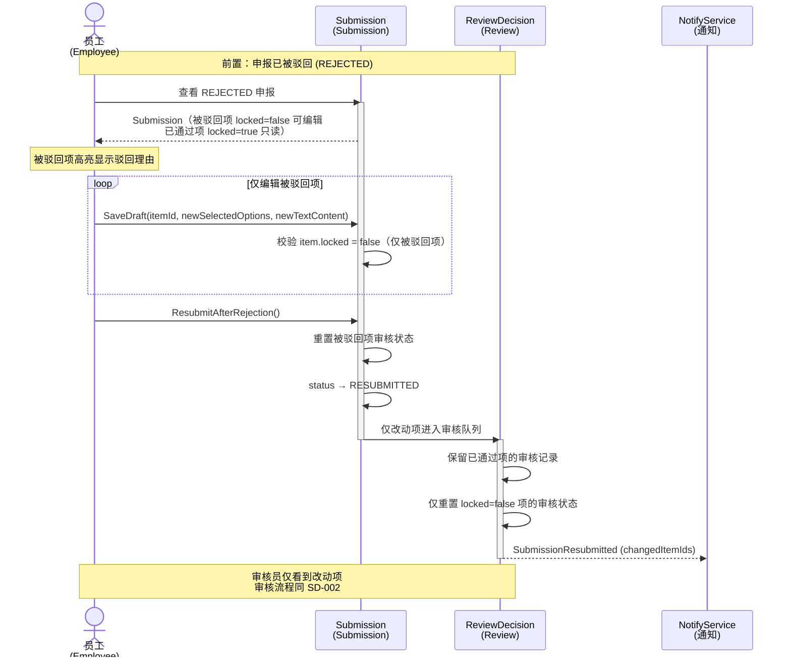
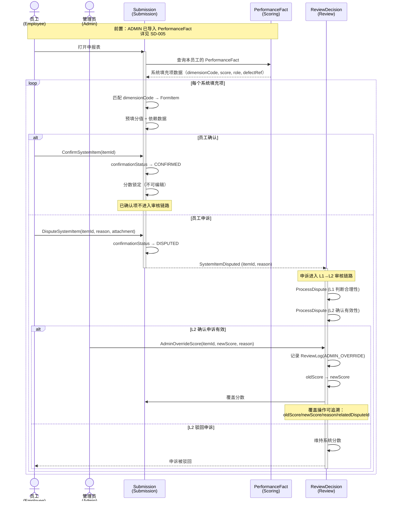
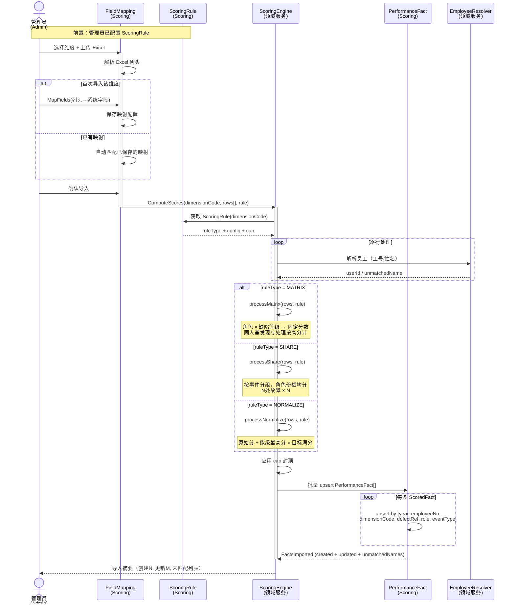

# 关键场景时序图 (LLD)

> 基于 PRD：`docs/prd.md`
> 用例分析：`02-用例分析.md`
> 领域建模：`03-领域建模.md`
> 生成时间：2026-06-16

## 元信息

| 项目 | 值 |
|------|-----|
| 时序图数量 | 5 |
| 覆盖用例数 | 10 / 19 |
| P0 场景 | 4 |
| P1 场景 | 1 |

---

## 场景覆盖矩阵

| 用例 | 时序图 | 状态 |
|------|--------|------|
| UC-001: 创建首个管理员 | — | ⏭️ (单聚合 CRUD，无跨上下文交互) |
| UC-002: 配置通知渠道 | — | ⏭️ (单聚合 CRUD) |
| UC-003: 管理组织架构 | — | ⏭️ (单聚合 CRUD) |
| UC-004: 设计申报模板 | — | ⏭️ (单上下文操作，无跨上下文消息) |
| UC-005: 发布/归档模板 | — | ⏭️ (模板状态变更已体现在其他流程中) |
| UC-006: 管理用户与角色 | — | ⏭️ (单聚合 CRUD) |
| UC-007: 批量导入用户 | — | ⏭️ (单聚合操作，无跨上下文消息) |
| UC-008: 员工注册 | — | ⏭️ (双参与者但流程简单：User + NotifyService) |
| UC-009: 登录系统 | — | ⏭️ (技术基础设施，非业务场景) |
| UC-010: 填报绩效申报 | SD-001 | ✅ |
| UC-011: 提交申报 | SD-001 | ✅ |
| UC-012: 驳回后重提 | SD-003 | ✅ |
| UC-013: 一级审核 | SD-002 | ✅ |
| UC-014: 二级终审 | SD-002 | ✅ |
| UC-015: 配置评分规则 | SD-005 | ✅ (导入流程的前置步骤) |
| UC-016: 导入绩效事实 | SD-005 | ✅ |
| UC-017: 导出绩效档案 | — | ⏭️ (技术流程已实现，非建模关键) |
| UC-018: 查看报表分析 | — | ⏭️ (纯查询视图，无状态变更) |
| UC-019: 配置自动预审规则 | SD-001 | ✅ (嵌入提交流程) |

---

## 时序图

### SD-001: 绩效申报提交（含自动预审）

| 属性 | 值 |
|------|-----|
| **关联用例** | UC-010 (填报绩效申报), UC-011 (提交申报), UC-019 (自动预审) |
| **优先级** | P0 |
| **入选原因** | 核心业务流程，跨 4 个上下文（Submission → Scoring → Notification），含自动预审引擎异步交互 |
| **参与者** | Employee, Submission (AGG-004), AutoReviewRule (AGG-010), FormTemplate (AGG-003), PreReviewEngine (domain_service), NotifyService (ACT-SYS-001), MinIO (ACT-SYS-002) |

**设计决策**：

1. 预审（PreReview）不阻断提交 — 架构决策原则 #3：软提示而非硬阻断
2. 附件上传到 MinIO 与草稿保存分离 — 附件先上传获得路径，草稿保存时关联
3. 能级等级（declarationLevel）由系统从 hireDate 实时计算，员工不可修改 — 原则 #9

**时序图**：

```mermaid
sequenceDiagram
  actor emp as 员工<br/>(Employee)
  participant tpl as FormTemplate<br/>(Template)
  participant sub as Submission<br/>(Submission)
  participant pre as PreReviewEngine<br/>(领域服务)
  participant rule as AutoReviewRule<br/>(Submission)
  participant minio as MinIO<br/>(对象存储)
  participant ntf as NotifyService<br/>(通知)

  emp->>tpl: 查看已发布模板列表
  activate tpl
  tpl-->>emp: PUBLISHED 模板列表
  deactivate tpl

  emp->>sub: StartSubmission(templateId)
  activate sub
  sub->>sub: 创建 DRAFT Submission
  sub->>sub: 自动计算 declarationLevel(hireDate)
  sub->>sub: 预填 headerFields(branch, dept, position)
  sub-->>emp: Submission (DRAFT)

  loop 逐章节填报
    emp->>sub: SaveDraft(itemId, selectedOptions, textContent)
    sub->>sub: 更新/创建 SubmissionItem

    opt 上传附件
      emp->>minio: UploadAttachment(file)
      activate minio
      minio-->>emp: minioPath
      deactivate minio
      emp->>sub: SaveDraft(itemId, attachment)
    end
  end

  emp->>sub: SubmitDeclaration()
  sub->>sub: 校验必填项完整性
  sub->>pre: EvaluatePreReview(workYears, declarationLevel)
  activate pre
  pre->>rule: 获取所有 enabled 规则
  rule-->>pre: AutoReviewRule[]

  loop 逐条规则
    pre->>pre: 工龄区间 + 能级匹配检查
  end

  pre-->>sub: PreReviewResult (passed + warnings[])
  deactivate pre

  alt 预审通过
    sub->>sub: status → SUBMITTED
    sub-->>ntf: SubmissionSubmitted
    deactivate sub
  else 预审有警告（不阻断）
    sub->>sub: status → SUBMITTED (附带 warnings)
    sub-->>ntf: SubmissionSubmitted (含 preReviewWarnings)
    deactivate sub
    Note over emp,ntf: 预审为软提示，不阻断提交<br/>审核员可见 warnings
  end
```

---

### SD-002: 两级审核与归档流程

| 属性 | 值 |
|------|-----|
| **关联用例** | UC-013 (一级审核), UC-014 (二级终审) |
| **优先级** | P0 |
| **入选原因** | 核心业务闭环的审核链路，跨 4 个上下文（Review → Submission → Archive → Notification），含审核状态机和归档触发 |
| **参与者** | L1Reviewer, L2Reviewer, ReviewDecision (AGG-005), Submission (AGG-004), PerformanceRecord (AGG-009), NotifyService (ACT-SYS-001) |

**设计决策**：

1. 审核必须逐项（per-option）决策 — 原则 #11 + #12：无整表通过/驳回
2. L1 审核员按 scopeBranchId 过滤 — 领域不变量
3. L2 全部通过后自动生成 PerformanceRecord（双存） — 原则 #10
4. 所有审核操作记录 ReviewLog（不可变审计）

**时序图**：

```mermaid
sequenceDiagram
  actor l1 as 一级审核员<br/>(L1Reviewer)
  actor l2 as 二级审核员<br/>(L2Reviewer)
  participant sub as Submission<br/>(Submission)
  participant rev as ReviewDecision<br/>(Review)
  participant rec as PerformanceRecord<br/>(Archive)
  participant ntf as NotifyService<br/>(通知)

  Note over l1,sub: ═══ 一级审核 (L1) ═══

  l1->>sub: 获取本分公司待审列表
  sub-->>l1: SUBMITTED 申报（scopeBranchId 匹配）

  l1->>rev: StartL1Review(submissionId)
  activate rev
  rev->>sub: status → L1_REVIEWING
  rev->>rev: 创建 ReviewLog (L1_START)

  loop 逐申报项逐选项
    l1->>rev: MakeL1OptionDecision(itemId, optionId, APPROVE/REJECT, reason)
    rev->>rev: 创建 SubmissionOptionReview 记录
    rev->>rev: 写入 ReviewLog

    opt 驳回某项
      Note over rev: 驳回理由必填
    end
  end

  l1->>rev: CompleteL1Review(submissionId)

  alt 全部通过
    rev->>sub: status → L1_APPROVED
    rev->>rev: ReviewLog (L1_COMPLETE: APPROVED)
    rev-->>ntf: SubmissionL1Approved
    deactivate rev
  else 任一驳回
    rev->>sub: status → REJECTED
    rev->>rev: 标记被驳回项 locked=true
    rev->>rev: ReviewLog (L1_COMPLETE: REJECTED)
    rev-->>ntf: SubmissionRejected (rejectedItemIds)
    deactivate rev
    Note over emp,ntf: 员工编辑被驳回项 → 重提<br/>详见 SD-003
  end

  Note over l2,rec: ═══ 二级审核 (L2) ═══

  l2->>sub: 获取所有 L1_APPROVED 申报
  sub-->>l2: L1_APPROVED 列表（不限分公司）

  l2->>rev: StartL2Review(submissionId)
  activate rev
  rev->>sub: status → L2_REVIEWING
  rev->>rev: 创建 ReviewLog (L2_START)

  loop 逐申报项逐选项
    l2->>rev: MakeL2OptionDecision(itemId, optionId, APPROVE/REJECT, reason)
    rev->>rev: 创建 SubmissionOptionReview 记录
    rev->>rev: 写入 ReviewLog
  end

  l2->>rev: CompleteL2Review(submissionId)

  alt 全部通过
    rev->>sub: status → APPROVED, 计算 totalScore
    rev->>rec: CreatePerformanceRecord(userId, year, totalScore, archivedData)
    activate rec
    rec->>rec: 校验 [userId, year] unique
    rec->>rec: 写入 archivedData (JSON 快照)
    rec-->>rev: PerformanceRecordCreated
    deactivate rec
    rev->>rev: ReviewLog (L2_COMPLETE: APPROVED)
    rev-->>ntf: SubmissionApproved (totalScore)
    deactivate rev
  else 任一驳回
    rev->>sub: status → REJECTED
    rev->>rev: 标记被驳回项 locked=true
    rev->>rev: ReviewLog (L2_COMPLETE: REJECTED)
    rev-->>ntf: SubmissionRejected (rejectedItemIds)
    deactivate rev
  end
```

---

### SD-003: 驳回后重提流程

| 属性 | 值 |
|------|-----|
| **关联用例** | UC-012 (驳回后重提) |
| **优先级** | P0 |
| **入选原因** | 核心业务闭环的纠偏路径，跨 2 个上下文（Review → Submission → Review），涉及状态机转换和锁定机制 |
| **参与者** | Employee, Submission (AGG-004), ReviewDecision (AGG-005), NotifyService |

**设计决策**：

1. 驳回后仅被驳回项可编辑（locked=true 的项锁定只读）— 原则：保护已审核通过的工作
2. 重提后仅改动项重新审核 — 已通过的审核记录保留
3. 状态流转：REJECTED → RESUBMITTED（非直接回到 SUBMITTED）

**时序图**：



---

### SD-004: 系统填充项确认与申诉流程

| 属性 | 值 |
|------|-----|
| **关联用例** | — (来自架构决策原则 #5，尚未独立成用例) |
| **优先级** | P0 |
| **入选原因** | 架构决策原则 #5 定义的混合表单交互模型，跨 3 个上下文（Scoring → Submission → Review），含 AdminOverride 审计链路 |
| **参与者** | Employee, Submission (AGG-004), PerformanceFact (AGG-007), ReviewDecision (AGG-005), Admin |

**设计决策**：

1. 系统填充项（来自 PerformanceFact 的项）需要员工确认或申诉 — 原则 #5
2. 确认后分数立即锁定，不进入审核链路
3. 申诉后进入 L1→L2 审核链路
4. ADMIN 覆盖分数必须记录 ReviewLog(ADMIN_OVERRIDE)，包含 oldScore/newScore — 原则 #5 审计要求

**时序图**：



---

### SD-005: 绩效事实数据导入与评分流程

| 属性 | 值 |
|------|-----|
| **关联用例** | UC-015 (配置评分规则), UC-016 (导入绩效事实) |
| **优先级** | P1 |
| **入选原因** | 跨 2 个上下文（Scoring 内部），涉及外部数据源 (Excel)→字段映射→评分引擎计算→事实持久化的完整数据处理链路 |
| **参与者** | Admin, FieldMapping (AGG-011), ScoringRule (AGG-006), ScoringEngine (domain_service), PerformanceFact (AGG-007), EmployeeResolver (domain_service) |

**设计决策**：

1. 字段映射按维度保存，同维度下次自动匹配 — 原则 #8
2. 评分引擎三种规则类型 (MATRIX/SHARE/NORMALIZE) 按维度分派 — 原则 #7
3. 员工匹配通过 EmployeeResolver（名册 CSV + 数据库联合查询）
4. 批量导入单事务 — 原则 #6 性能约束

**时序图**：



---

## 审查报告

### 术语一致性

> ℹ️ 未配置 `terminology_file`（`CONTEXT.md` 不存在），跳过术语一致性检查。

### 场景选择自检

| # | 入选标准 | SD 覆盖 |
|---|---------|--------|
| 1 | PRD §5 核心端到端流程 | ✅ SD-001 + SD-002 覆盖完整申报→审核→归档链路 |
| 2 | 跨 ≥3 个上下文 | ✅ SD-001 (4), SD-002 (4), SD-004 (3) |
| 3 | 异步/事件驱动 | ✅ SD-001 (PreReview 引擎), SD-005 (Scoring 引擎) |

### 参与者完整性

| 时序图 | 缺失检查 |
|--------|---------|
| SD-001 | ✅ FormTemplate, Submission, AutoReviewRule, PreReviewEngine, MinIO, NotifyService 均已声明 |
| SD-002 | ✅ ReviewDecision, Submission, PerformanceRecord, NotifyService 均已声明 |
| SD-003 | ✅ Submission, ReviewDecision, NotifyService 均已声明 |
| SD-004 | ✅ Submission, PerformanceFact, ReviewDecision, Admin 均已声明 |
| SD-005 | ✅ FieldMapping, ScoringRule, ScoringEngine, PerformanceFact, EmployeeResolver 均已声明 |

### 待确认项

1. **场景选择**：当前 5 个时序图覆盖了核心流程（申报→审核→归档）、驳回纠偏、系统填充项、数据导入。是否有需要补充的关键场景？
2. **异步边界**：SD-001 中 PreReviewEngine 和 SD-005 中 ScoringEngine 为同步调用（当前实现），是否需要改为异步处理（消息队列/后台 Job）？
3. **申诉流程实现**：✅ 已确认 — 时序图反映目标架构（设计原则 #5），代码待实现
4. **异步边界**：✅ 已确认 — 保持同步调用（PreReviewEngine + ScoringEngine 均为同步）
5. **场景覆盖**：✅ 已确认 — 5 个时序图覆盖完整，无需补充
