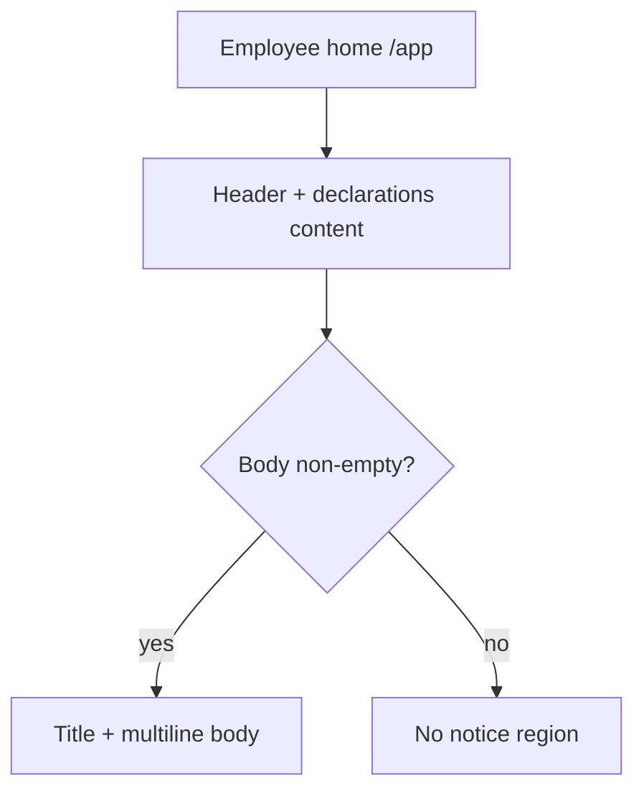

# Employee Home Notice - Plan

## Goal Capsule

- **Objective:** Let admins maintain a simple title + body notice that employees see at the bottom of the post-login home page, for tech-support contacts and operational tips.
- **Product authority:** This Product Contract (unchanged from brainstorm).
- **Open blockers:** None.
- **Execution:** `code`.
- **Stop when:** R1–R6 and A1–A3 are satisfied; verification commands below pass; abandoned experiment code is removed.

## Product Contract

### Summary

Add a global, admin-editable notice (editable title and plain multiline body) shown at the bottom of the employee home page (`/app`). When the body is empty, the notice is hidden.

### Key Decisions

- **Show only on post-login home, not login page** — employees need the tip after they are in the app; pre-login clutter is out of v1. `(session-settled: user-directed — chosen over login page or both surfaces: matches “登录后可见” intent)`
- **Plain multiline text only** — free-form content is enough for phone/WeChat/tips; structured contact fields and rich text add carrying cost without clear need. `(session-settled: user-directed — chosen over structured fields or rich text: simplest maintainable path)`
- **Empty body hides the block; no enable switch** — one less config item; publishing = having text. `(session-settled: user-directed — chosen over enable toggle or both: empty-as-off is enough)`
- **Title and body both editable** — admins can retitle (e.g. 技术支持 / 申报须知) without a code change. `(session-settled: user-directed — chosen over fixed title or no title: low cost, more flexible)`
- **One global notice for all employees** — same support tip applies org-wide in v1; per-branch variants deferred.

### Actors

- **Admin** — creates and updates the notice title and body.
- **Employee** — views the notice on the post-login home page when body is non-empty.

### Key Flows

- F1. Admin updates notice
  - **Trigger:** Admin opens the notice settings surface and saves title/body.
  - **Actors:** Admin
  - **Steps:** Edit title and/or body; save; change takes effect for subsequent employee home loads.
  - **Outcome:** Stored notice reflects the latest text.
- F2. Employee sees notice
  - **Trigger:** Employee opens post-login home (`/app`).
  - **Actors:** Employee
  - **Steps:** Home loads main content; if body is non-empty, footer region shows title + body; if body empty, no notice region.
  - **Outcome:** Support/tip text is visible without leaving the home page.

### Requirements

**Admin**

- R1. An admin with system-admin authority can view and edit a single global notice consisting of a title and a plain multiline body.
- R2. Saving replaces the previous title and body; there is no version history requirement in v1.

**Employee home**

- R3. When the body is non-empty after trim, the employee home page shows the notice at the bottom of the page, below existing home content.
- R4. The notice displays the current title and body; body line breaks are preserved in display.
- R5. When the body is empty after trim, the notice region is not rendered (no empty box).
- R6. The notice is not shown on the login page or on other employee routes in v1.

### Acceptance Examples

- A1. Publish tip
  - **Covers:** R1, R3, R4
  - **Given:** Admin sets title「技术支持」and body with a phone number and a tip line
  - **When:** Employee opens `/app`
  - **Then:** Bottom of the page shows that title and body with line breaks preserved
- A2. Clear to hide
  - **Covers:** R2, R5
  - **Given:** A notice currently visible to employees
  - **When:** Admin clears the body and saves
  - **Then:** Employee home no longer shows a notice region
- A3. Title-only does not publish
  - **Covers:** R5
  - **Given:** Admin sets a title but leaves body empty
  - **When:** Employee opens `/app`
  - **Then:** No notice region appears

### Scope Boundaries

**In scope**

- Global title + plain multiline body
- Admin edit + employee home bottom display
- Hide when body empty

**Deferred for later**

- Login page or site-wide employee layout footer
- Per-branch / per-role notice variants
- Rich text, links-as-widgets, images, attachments
- Enable/disable switch independent of content
- Scheduling / expiry / multi-notice list
- Changing or removing the existing submission-page `supportPhone` footer

## Planning Contract

### Key Technical Decisions

- **Extend existing `AppConfig` singleton rather than a new model** — `AppConfig` (`id=1`) already holds org-wide support/compliance settings; add `homeNoticeTitle` and `homeNoticeBody` next to `supportPhone`. `(session-settled: user-directed — chosen over new admin page or replacing supportPhone: keeps one config surface, leaves submission phone intact)`
- **Admin UI nests under `/admin/app-config`** — same page as「申报合规与技术支持」; add a distinct section for homepage title/body; keep declaration modal + support phone fields unchanged.
- **Reuse public config read path** — employee home reads via existing `getAppConfig` / `/api/public/app-config` (SSR preferred on `/app`); do not invent a second public endpoint.
- **Visibility rule is body-trim only** — empty/whitespace body ⇒ hide; empty title with non-empty body still shows (title omitted or blank heading avoided — render title only when title trim is non-empty).
- **Do not fold home fields into `noticeRevision`** — declaration forced-read ack must not re-trigger when only home notice text changes.

### Assumptions

- Title max length ~100 chars and body max ~5000 chars are sufficient for support tips; exact Zod limits can be tuned in implementation without product change.
- Admin home card copy on `/admin` may be lightly updated to mention homepage tip; not a separate product requirement.

### Implementation Constraints

- Follow singleton upsert pattern in `src/app/api/admin/app-config/route.ts` and `src/lib/app-config.ts`.
- Auth: admin mutations via `requireAdmin`; public GET remains unauthenticated (same as today).
- Preserve submission-page `SupportPhoneFooter` behavior.
- Match employee home Tailwind language (slate/primary borders, rounded-xl sections).

### Sequencing

1. Persist fields (schema + lib + APIs)
2. Admin edit UI
3. Employee home render
4. Unit tests for visibility / config mapping

### Sources / Research

- Existing pattern: `prisma/schema.prisma` `AppConfig`; `src/lib/app-config.ts`; `src/app/api/admin/app-config/route.ts`; `src/app/api/public/app-config/route.ts`; `src/app/admin/app-config/page.tsx`
- Submission phone footer (do not replace): `src/components/support-phone-footer.tsx` used from `src/app/app/submission/[templateId]/page.tsx`
- Employee home target: `src/app/app/page.tsx`
- Admin nav card: `src/app/admin/page.tsx` 「申报合规与技术支持」

## Implementation Units

### U1. Persist homepage notice on AppConfig

- **Goal:** Store and expose `homeNoticeTitle` / `homeNoticeBody` through the existing AppConfig singleton.
- **Requirements:** R1, R2
- **Files:** `prisma/schema.prisma`, new Prisma migration under `prisma/migrations/`, `src/lib/app-config.ts`, `src/app/api/admin/app-config/route.ts`, `src/lib/use-app-config.ts` (type only if still used for public shape)
- **Approach:** Add two string columns (title default `""`, body `@db.Text` default `""`). Extend `AppConfigPublic` / `getAppConfig` / admin Zod PUT schema. Keep `noticeRevision` hashing on declaration fields only. Cite KTD: extend AppConfig; do not fold into noticeRevision.
- **Test scenarios:**
  - Happy: after upsert with title+body, `getAppConfig()` returns trimmed title and body.
  - Edge: whitespace-only body is stored trimmed to empty (or returned trimmed empty) so visibility treats it as hidden.
  - Edge: updating home notice fields does not change `noticeRevision` when declaration text/seconds unchanged.
  - Error: admin PUT with oversize body/title rejected with 400.
- **Verification:** `npx tsx --test src/lib/app-config.test.ts` (create if missing); `pnpm prisma:generate` succeeds after schema change.
- **Dependencies:** none

### U2. Admin edit section on app-config page

- **Goal:** Admins can edit homepage title and body on the existing compliance/support settings page.
- **Requirements:** R1, R2
- **Files:** `src/app/admin/app-config/page.tsx`, optionally `src/app/admin/page.tsx` (nav card description)
- **Approach:** Add a labeled section (e.g.「员工首页提示」) with title input + multiline textarea; load/save via existing `/api/admin/app-config`. Clarify in helper text that empty body hides the employee home block; leave support phone + declaration notice UI untouched. Cite KTD: nest under `/admin/app-config`.
- **Test scenarios:**
  - Happy: load shows saved title/body; save persists and success message appears.
  - Edge: clear body and save; reload shows empty body fields.
  - **Test expectation:** no dedicated unit test required for the client form — covered by U1 API/lib tests plus manual smoke on save/reload.
- **Verification:** Manual smoke: open `/admin/app-config`, save homepage fields, refresh, values stick.
- **Dependencies:** U1

### U3. Render notice on employee home

- **Goal:** Show the notice at the bottom of `/app` when body is non-empty; hide otherwise.
- **Requirements:** R3, R4, R5, R6; A1–A3
- **Files:** `src/app/app/page.tsx`; optionally small presentational helper in `src/components/` (e.g. `home-notice.tsx`) if it keeps the SSR page readable
- **Approach:** In `EmployeeHome`, load config via `getAppConfig()` (SSR). After existing sections, if `homeNoticeBody.trim()` is non-empty, render a bottom section with optional title and `whitespace-pre-wrap` body. Do not mount on login or other `/app/*` routes. Cite session-settled decisions: home-only; empty body hides; editable title.
- **Test scenarios:**
  - Happy (A1): non-empty body ⇒ section renders title + body with preserved newlines.
  - Edge (A2/A3): empty/whitespace body ⇒ component/region returns null even if title set.
  - Edge: non-empty body + empty title ⇒ body still shown without a meaningless empty heading.
  - Prefer a tiny pure helper (e.g. `shouldShowHomeNotice(body)`) tested in `src/lib/app-config.test.ts` or colocated test rather than mounting the full page.
- **Verification:** Helper unit tests + manual smoke on `/app` with/without body.
- **Dependencies:** U1

## Verification Contract

| Gate | Command / check | Applies |
|---|---|---|
| Unit | `npx tsx --test src/lib/app-config.test.ts` | After U1/U3 |
| Lint | `pnpm lint` | Before done |
| Type/build | `pnpm build` (or targeted tsc if faster locally) | Before done |
| Manual smoke | Admin save → employee `/app` shows; clear body → hidden; submission page phone still works | Before done |
| Migration | Apply Prisma migrate in the target environment before deploy | Release |

## Definition of Done

- All units U1–U3 complete; R1–R6 and A1–A3 hold.
- Product Contract preservation still accurate (no silent product-scope rewrite).
- Submission-page `supportPhone` footer unchanged.
- Verification Contract gates above pass; no abandoned WIP files left in the diff.
- Prisma migration included for the new columns.
